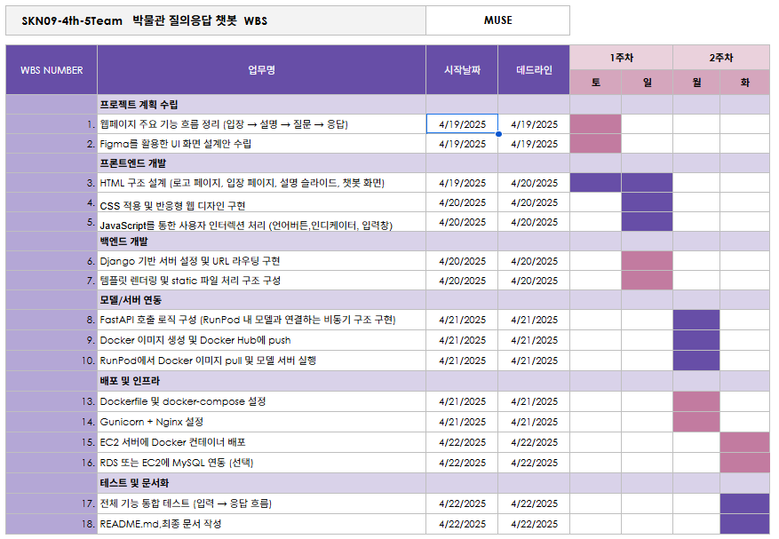

# **SKN09-4th-5Team**

> SK네트웍스 Family AI 캠프 9기 4차 프로젝트 
> 개발기간: 25.04.19 - 25.04.22

 

---

# 📚 Contents

1. [팀 소개](#1-introduce-team)
2. [프로젝트 개요](#2-project-overview)
3. [기술 스택 및 사용 모델](#3-technology-stack--models)
4. [시스템 아키텍처](#4-시스템-아키텍처)
5. [요구사항 명세서](#5-요구사항-명세서)
6. [화면설계서](#6-화면설계서)
7. [WBS](#7-wbs)
8. [테스트 계획 및 결과 보고서](#8-테스트-계획-및-결과-보고서)
9. [수행결과](#9-수행결과)
10. [디렉토리 구조](#10-디렉토리-구조)
11. [결론](#11-결론)
12. [한 줄 회고](#12-한-줄-회고)
 
 

---

# 1. Introduce Team

#### 💡팀명: MUSE (Multilingual Universal Storyteller Engine)
#### 💡프로젝트명: LLM을 연동한 내외부 문서 기반 질의 응답 웹페이지 개발
 

##### ⬇️팀원 소개 ⬇️

<table align="center" width="100%">
  <tr>
    <td align="center">
      <a href="https://github.com/youngseo98"><b>@김영서</b></a>
    </td>
    <td align="center">
      <a href="https://github.com/Leegwangwoon"><b>@이광운</b></a>
    </td>
    <td align="center">
      <a href="https://github.com/daainn"><b>@이다인</b></a>
    </td>
    <td align="center">
      <a href="https://github.com/ohback"><b>@임수연</b></a>
    </td>
    <td align="center">
      <a href="https://github.com/SIQRIT"><b>@조이현</b></a>
    </td>
  </tr>
  <tr>
    <td align="center"></td>
    <td align="center"></td>
    <td align="center"></td>
    <td align="center"></td>
    <td align="center"></td>
  </tr>
</table>

---

# 2. Project Overview
### ✅ 프로젝트 소개
본 프로젝트는 LLM(대형 언어 모델)을 기반으로 개발한 **박물관 도슨트 챗봇 모델**에 웹 페이지를 연동하여, 실제 사용자들이 접근 가능한 웹 기반 질의응답형 도슨트 서비스로 발전시키는 것을 목표로 합니다. 이 챗봇은 관람객이 박물관 작품에 대해 궁금한 점을 자유롭게 질문하면 유물의 시대적, 문화적 맥락을 바탕으로 하여 한국어, 영어 또는 일본어로 응답을 제공해주는 인터랙티브 시스템으로

사용자는 웹 페이지를 통해 언제 어디서나 편리하게 챗봇에 접근할 수 있으며, 직관적인 UI를 통해 질문하고 답변을 받는 형태로 보다 쉽고 흥미로운 방식으로 세계 문화를 경험할 수 있습니다.

### ✅ 프로젝트 필요성

현재 국립중앙박물관 애플리케이션에는 ‘스마트전시관 챗봇’ 서비스가 제공되고 있으며, 박물관 내 건물과 전시품의 위치를 효과적으로 안내하는 데 특화되어 있습니다.

저희는 여기서 한 걸음 더 나아가, **작품에 대한 충분한 맥락과 이해를 제공하는 기능이 더해진다면**  관람객의 **이해도와 몰입도**를 더욱 높일 수 있을 것이라 판단하였습니다.  
이에 따라 본 프로젝트는 **작품 설명에 특화된 질의응답형 도슨트 챗봇**의 필요성을 바탕으로 기획되었습니다.

또한 최근 다양한 분야에서 사용자 맞춤형 서비스가 확대되는 흐름에 따라, 본 챗봇에  
- **다국어 지원 기능**을 통해 외국인 관람객의 접근성을 높이고  
- **음성 기반 설명 기능**으로 시각 외 정보 전달 방식을 확장하며  
- **연령별 맞춤 콘텐츠 제공**을 통해 다양한 관람층의 수요를 반영하는 등  

사용자 중심의 기능들을 추가하여 **보다 포괄적이고 몰입감 있는 박물관 관람 경험**을 구현하고자 하였습니다.

<table align="center">
  <tr>
    <td align="center">
      
    </td>
    <td align="center">
      
    </td>
  </tr>
</table>
> 현재 국립중앙박물관 챗봇 서비스에는 작품 설명에 관한 챗봇 시스템은 따로 구현되어 있지 않습니다.

### ✅ 프로젝트 목표
- 전시품 설명에 특화된 질의응답형 챗봇 서비스 개발
- 다국어 지원을 통한 관람객 접근성 및 경험 향상
- 음성 기반의 전시품 설명 기능 제공
- 자연어 처리 기반의 연령 맞춤형 콘텐츠 제공

 

---

# 3. Technology Stack & Models

## ✅ 기술 스택 및 사용한 모델

| **Language** | **Development** | **Embedding Model** | **Vector DB** | **LLM Model** | **Framework** | **Demo** | **Collaboration Tool** |
|--------------|------------------|----------------------|----------------|----------------|----------------|-------------|--------------------|
|  |    |  <a href="https://huggingface.co/intfloat/multilingual-e5-large">모델 주소</a> |  |   :현재 개발중 |  |  |    |

  

---

# 4. 시스템 아키텍처

  

---

# 5. 요구사항 명세서

  

---

# 6. 화면설계서

  

---

# 7. WBS

  

---

# 8. 테스트 계획 및 결과 보고서
### ✅ 테스트 계획

### ✅ 결과 보고서

  

---

# 9. 수행결과
### ✅ 시연 결과

 

### ✅ 출력답변

  

---

# 10. 디렉토리 구조

  

---

# 11. 결론 ---> 3차에서 추후 업데이트 계획으로 작성했던 것들 회수하기

  

---

# 12. 한 줄 회고
- **🤭김영서**:  
- **🙃이광운**: 
- **🫡이다인**: 
- **😊임수연**: 
- **🫠조이현**: 동작트리거에 대한 Javascript와 html의 연계구조를 사용함으로써, 조건문에 대한 Front-end 분기설정 활용법을 배웠다. 또한 Docker, EC2, SageMaker 등 현재 수행 중인 Task에 적합한 서버를 선정하는 것이, 인스턴스 동작에 대한 사용자 편의성에 영향을 끼친다는 사실을 배웠다.
