# **SKN09-4th-5Team**

> SK네트웍스 Family AI 캠프 9기 3차 프로젝트 <br>
> 개발기간: 25.04.19 - 25.04.22

<br>

---

# 📚 Contents

1. [팀 소개](#1-introduce-team)
2. [프로젝트 개요](#2-project-overview)
3. [기술 스택 및 사용 모델](#3-technology-stack--models)
4. [시스템 아키텍처](#4-시스템-아키텍처)
5. [요구사항 명세서](#5-요구사항-명세서)
6. [화면설계서](#6-화면설계서)
7. [WBS](#7-wbs)
8. [테스트 계획 및 결과 보고서](#8-테스트-계획-및-결과-보고서)
9. [수행결과](#9-수행결과)
10. [디렉토리 구조](#10-디렉토리-구조)
11. [한 줄 회고](#11-한-줄-회고)
<br>
<br>

---

# 1. Introduce Team

#### 💡팀명: MUSE (Multilingual Universal Storyteller Engine)
#### 💡프로젝트명: LLM을 연동한 내외부 문서 기반 질의 응답 웹페이지 개발
<br>

##### ⬇️팀원 소개 ⬇️

<table align="center" width="100%">
  <tr>
    <td align="center">
      <a href="https://github.com/youngseo98"><b>@김영서</b></a>
    </td>
    <td align="center">
      <a href="https://github.com/Leegwangwoon"><b>@이광운</b></a>
    </td>
    <td align="center">
      <a href="https://github.com/daainn"><b>@이다인</b></a>
    </td>
    <td align="center">
      <a href="https://github.com/ohback"><b>@임수연</b></a>
    </td>
    <td align="center">
      <a href="https://github.com/SIQRIT"><b>@조이현</b></a>
    </td>
  </tr>
  <tr>
    <td align="center"></td>
    <td align="center"></td>
    <td align="center"></td>
    <td align="center"></td>
    <td align="center"></td>
  </tr>
</table>

---


# 2. Project Overview

### ✅ 프로젝트 소개
본 프로젝트는 LLM(대형 언어 모델)을 기반으로 개발한 박물관 도슨트 챗봇 모델에 웹 페이지를 연동하여, 실제 사용자들이 접근 가능한 웹 기반 질의응답형 도슨트 서비스로 발전시키는 것을 목표로 합니다. 이 챗봇은 관람객이 박물관 작품에 대해 궁금한 점을 자유롭게 질문하면 유물의 시대적, 문화적 맥락을 바탕으로 하여 한국어, 영어 또는 일본어로 응답을 제공해주는 인터랙티브 시스템으로 사용자는 웹 페이지를 통해 편리하게 챗봇에 접근할 수 있으며, 직관적인 UI를 통해 질문하고 답변을 받는 형태로 보다 쉽고 흥미로운 방식으로 국립중앙박물관의 소장품을 경험할 수 있습니다.

### ✅ 프로젝트 필요성


<table align="center">
  <tr>
    <td align="center">
      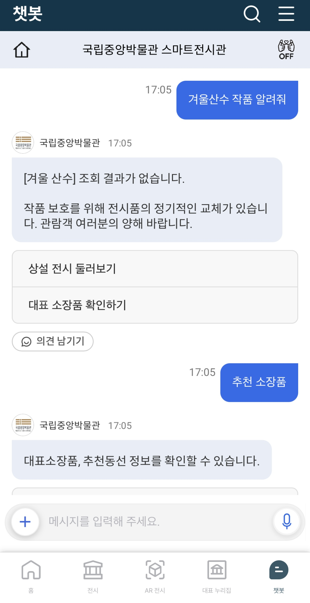
    </td>
    <td align="center">
      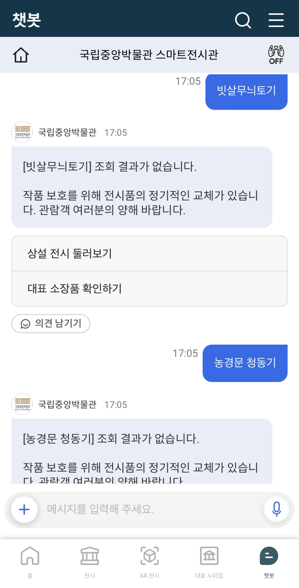
    </td>
  </tr>
</table>

국립중앙박물관 챗봇 서비스에는 작품 설명에 관한 시스템이 따로 구현되어 있지 않아 관람객의 이해와 몰입도를 높일 수 있는 질의응답형 도슨트 챗봇의 필요성을 느끼게 되었습니다. 박물관 관람객은 별도의 설치나 기술적 지식 없이도 웹 브라우저를 통해 챗봇에 접근할 수 있으며, 직관적인 인터페이스와 다국어 지원 기능을 통해 국내외 다양한 사용자에게 유물 해설 콘텐츠를 손쉽게 제공할 수 있습니다.

### ✅ 프로젝트 목표

- 질의응답형 도슨트 모델의 웹 연동
- 다국어 기반 사용자 경험 제공
- TTS를 통한 음성 안내 기능
- 국립중앙박물관 티켓 번호 입력 후 기능 무료 제공


<br>

---

# 3. Technology Stack & Models

## ✅ 기술 스택 및 사용한 모델


| **Frontend** | **Backend** | **Model Hosting** | **LLM Model** | **Vector DB** | **Deployment** | **Collaboration Tool** |
|--------------|-------------|-------------------|----------------|----------------|----------------|----------------------|
| <br><br> | <br> | |<br> |  | <br> | <br><br> |


<br><br>

---

# 4. 시스템 아키텍처

<div align="center">
  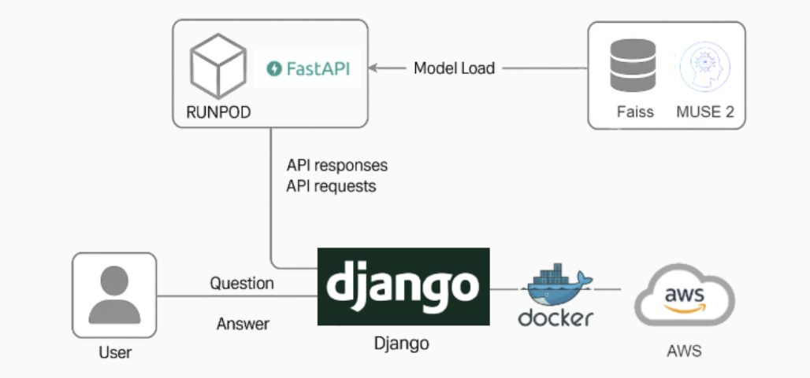
</div>

<br><br>

---


# 6. 화면설계서

> 사진을 클릭하면 자세히 볼 수 있습니다.

<table align="center">
  <tr>
    <td align="center">
      <a href="./images/화면설계서1.png" target="_blank">
        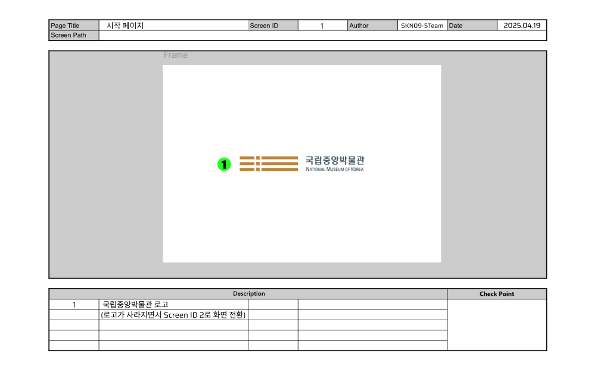
      </a>
    </td>
    <td align="center">
      <a href="./images/화면설계서2.png" target="_blank">
        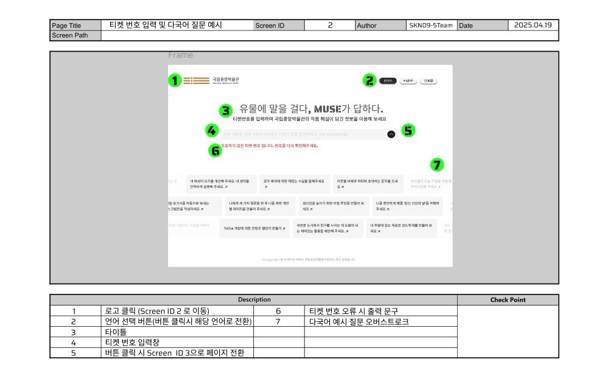
      </a>
    </td>
  </tr>
</table>

<table align="center">
  <tr>
    <td align="center">
      <a href="./images/화면설계서3.png" target="_blank">
        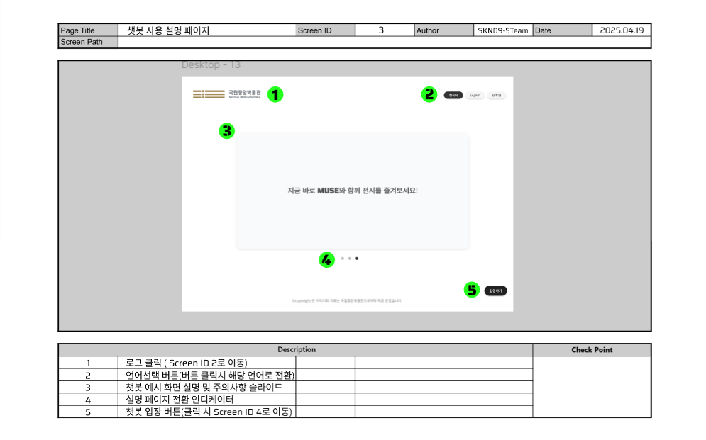
      </a>
    </td>
    <td align="center">
      <a href="./images/화면설계서4.png" target="_blank">
        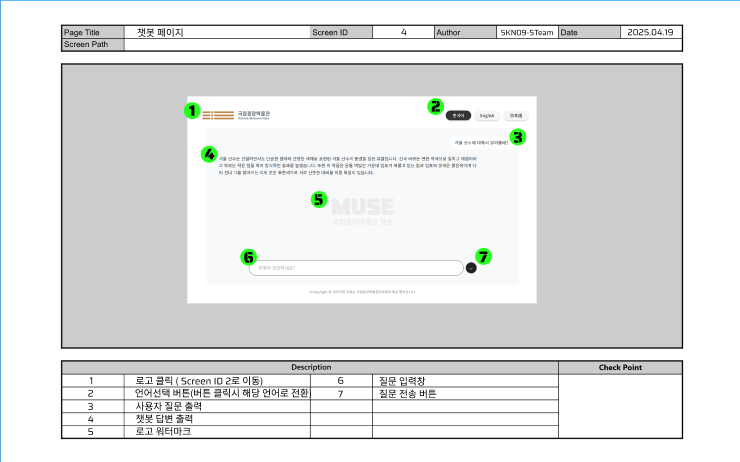
      </a>
    </td>
  </tr>
</table>


<br>

---

# 8. 테스트 계획 및 결과 보고서
### ✅ 테스트 보고서<br>

**테스트 실행 환경**
본 테스트는 Windows 11 (10.0.26100) 환경의 로컬 개발 서버에서 수행되었으며, Python 3.12.9, Django 5.2, Transformers 4.50.0 버전을 기반으로 구성된 시스템에서 테스트가 진행되었습니다.


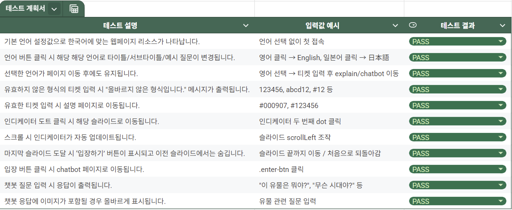


<br>


---

# 9. 수행결과

### ✅ 출력 결과
#### ♦️ 로고 페이지


#### ♦️ 랜딩 페이지
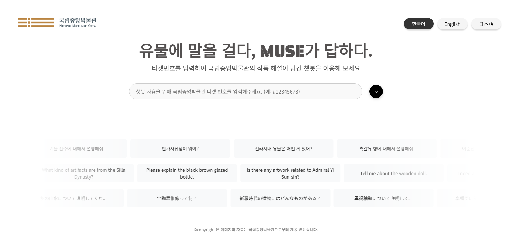

#### ♦️ 설명 페이지(MUSE 설명 탭 - 한국어)
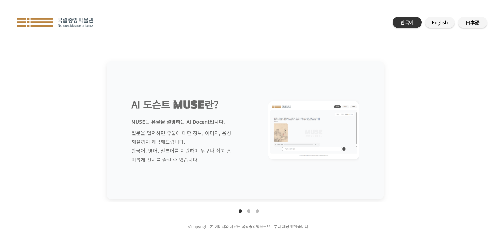

#### ♦️ 설명 페이지(이용방법 탭 - 영어)
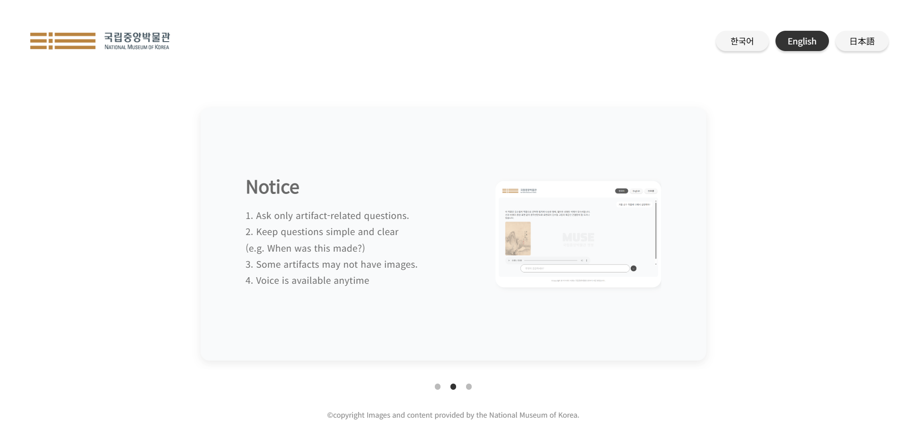

#### ♦️ 설명 페이지(입장버튼 탭 - 일어)
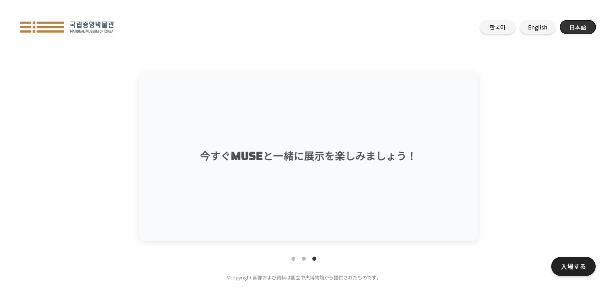

#### ♦️ 챗봇 페이지(빈 화면)
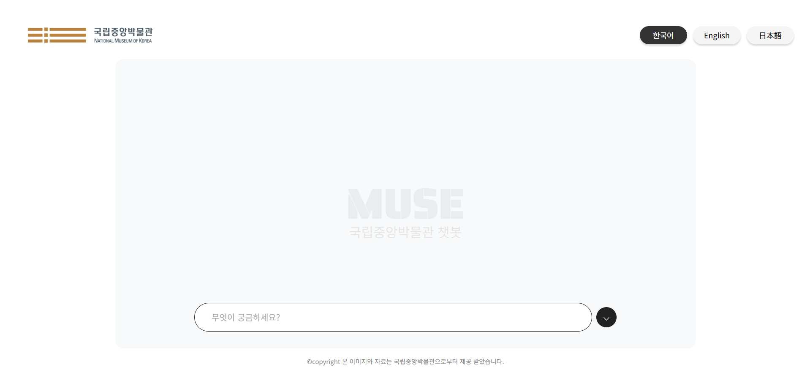

#### ♦️ 챗봇 페이지(응답 출력 화면)
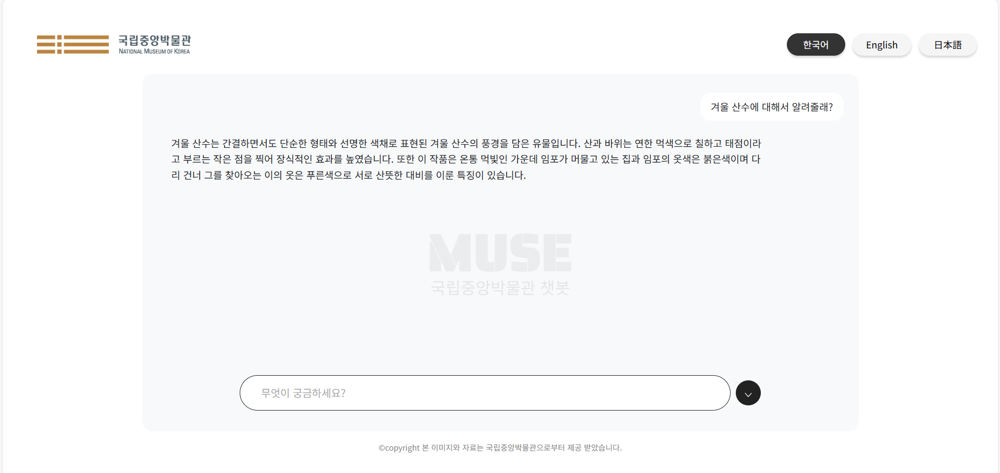

<br><br>

---

# 10. 디렉토리 구조

```
MUSE/
├─📁 .github/
│  └─📁 ISSUE_TEMPLATE/
│     ├── bug_report.md
│     └── feature_request.md
│
├─📁 .vscode/
│  └─ settings.json
│
├── 📁 chatbot/ 
│   ├── 📁 __pycache__/                  
│   ├── 📁 migrations/
│   │   ├── 📁 __pycache/
│   │   └── __init.py__
│   │
│   ├── 📁 static/              
│   │   ├── 📁 css/             
│   │   │   ├── chatbot.css
│   │   │   ├── explain.css
│   │   │   ├── landing-style.css
│   │   │   └── logo-express.css
│   │   ├── 📁 image/           
│   │   │   ├── chatbot.png
│   │   │   ├── logo.svg
│   │   │   ├── logo1.png
│   │   │   ├── logo2.svg
│   │   │   ├── winter-landscape.png
│   │   │   └── 국립중앙박물관.png
│   │   └── 📁 js/               
│   │       ├── chatbot.js
│   │       ├── explain.js
│   │       ├── landing-script.js
│   │       ├── lang-handlers.js
│   │       └── logo-splash.js
│   │
│   ├── 📁 templates/            
│   │   ├── chatbot-page.html
│   │   ├── explain-page.html
│   │   ├── landing-page.html
│   │   └── logo-page.html
│   │
│   ├── __init__.py
│   ├── admin.py
│   ├── apps.py
│   ├── models.py
│   ├── tests.py
│   ├── urls.py
│   └── views.py
│
├── 📁 images/
│
├── 📁 muse/
│   ├── 📁 __pycache__/              
│   ├── __init__.py
│   ├── asgi.py
│   ├── settings.py
│   ├── urls.py
│   └── wsgi.py
│
├── db.sqlite3
├── manage.py                   
└── README.md
```

<br><br>

---


# 11. 한 줄 회고
- **🤭김영서**: 백엔드부터 프론트엔드까지 직접 만들면서 AWS와 Docker 활용법, 그리고 서버 운영에 대한 감을 잡을 수 있었던 프로젝트였다.
- **🙃이광운**: RunPod에서 모델을 호출하는 과정에서 GPU VRAM과 컨테이너 메모리 설정에 어려움을 겪으며, 적절한 자원 설정이 안정적인 서비스 운영의 핵심이라는 걸 깨달았다.
- **🫡이다인**: 처음에 프론트엔드와 백엔드의 역할에 대한 혼동으로, 백엔드에서 수행해야 할 FastAPI 호출 작업을 자바스크립트 단에서 처리하려다 충돌이 발생했다.
이 경험을 통해 기능의 책임을 구분하는 설계의 중요성을 체감했고, Django와 FastAPI 간 연동 구조를 구성하는 법을 배울 수 있었다.
- **😊임수연**: Django, Docker, ec2를 통해 웹에서 입력 받은 사용자의 인풋과 AI 모델 응답을 연결하는 구조를 만들어가는 과정에서 프론트엔드와 백엔드의 소통이 중요하다고 느꼈고 생소했던 서비스 배포의 과정을 배울 수 있었다.
- **🫠조이현**: 동작트리거에 대한 Javascript와 html의 연계구조를 사용함으로써, 조건문에 대한 Front-end 분기설정 활용법을 배웠다. 또한 Docker, EC2, SageMaker 등 현재 수행 중인 Task에 적합한 서버를 선정하는 것이, 인스턴스 동작에 대한 사용자 편의성에 영향을 끼친다는 사실을 깨달았다.
